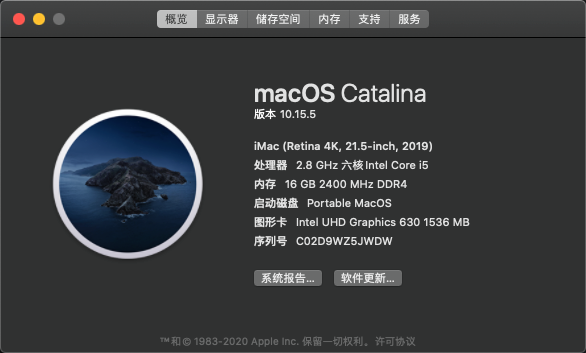
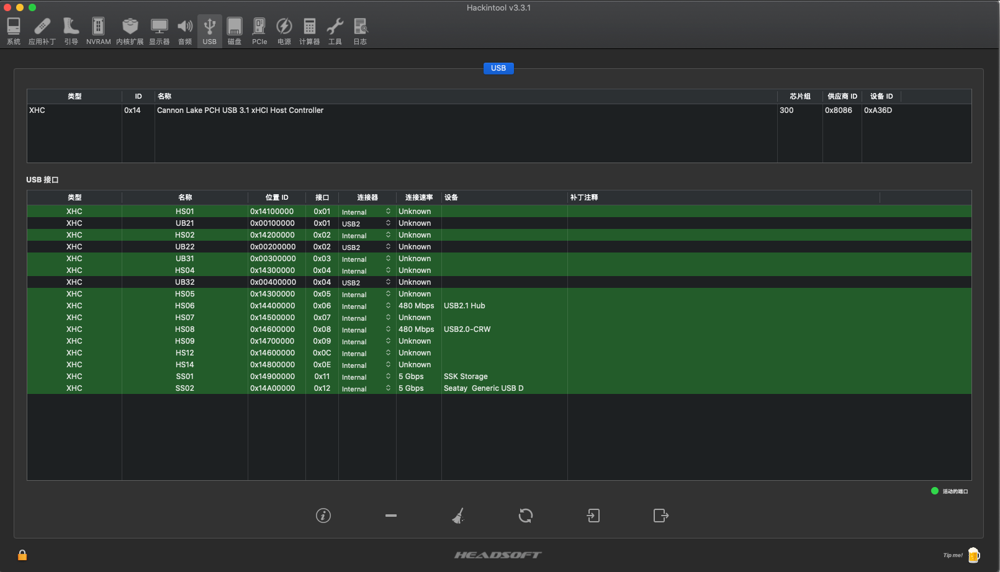

# Hackintosh:  Dell-Vostro-3670

### 引导

**OpenCore Version**： [0.5.9](https://github.com/acidanthera/OpenCorePkg/releases/tag/0.5.9)

**macOS Version**：macOS Catalina 10.15.6

### 配置单

* 电脑型号 戴尔 Vostro 3670-China HDD Protection 台式电脑 
* 操作系统 Windows 10 专业版 64位 ( DirectX 12 )
* 处理器 英特尔 Core i5-8400 @ 2.80GHz 六核
* 主板 戴尔 0FPP7F ( B360 芯片组 )
* 内存 16 GB ( 镁光 DDR4 2400MHz )
* 主硬盘 东芝 DT01ACA100 ( 1 TB / 7200 转/分 )
* 显卡 英特尔 UHD Graphics 630 ( 128 MB / 戴尔 )
* 显示器 联想 LEN61CE LEN P24i-10 ( 24 英寸  )
* 声卡 瑞昱  @ 英特尔 High Definition Audio 控制器
* 网卡 瑞昱 RTL8168/8111/8112 Gigabit Ethernet Controller / 戴尔

### 支持功能

* 显卡、声卡、有线网卡正常

* 前置 USB 3.0 * 2

### 截图

**关于本机**

**Hackintool**

