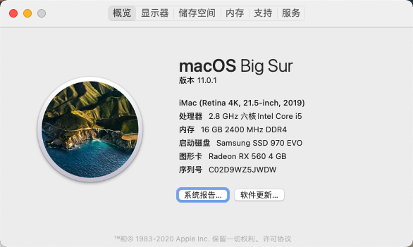

# Hackintosh:  Dell-Vostro-3670

## 简介

### 引导

**OpenCore Version**： [0.5.9](https://github.com/acidanthera/OpenCorePkg/releases/tag/0.5.9)

**macOS Version**：macOS Catalina 10.15.6

### 配置单

* 电脑型号 戴尔 Vostro 3670-China HDD Protection 台式电脑 
* 操作系统 Windows 10 专业版 64位 ( DirectX 12 )
* 处理器 英特尔 Core i5-8400 @ 2.80GHz 六核
* 主板 戴尔 0FPP7F ( B360 芯片组 )
* 内存 16 GB ( 镁光 DDR4 2400MHz )
* 主硬盘 东芝 DT01ACA100 ( 1 TB / 7200 转/分 )
* 显卡 英特尔 UHD Graphics 630 ( 128 MB / 戴尔 )
* 显示器 联想 LEN61CE LEN P24i-10 ( 24 英寸  )
* 声卡 瑞昱  @ 英特尔 High Definition Audio 控制器
* 网卡 瑞昱 RTL8168/8111/8112 Gigabit Ethernet Controller / 戴尔

### 支持型号
理论上，相同配置（主板、CPU）的 Dell 品牌机或 DIY 攒机均可直接使用此 EFI。
已在如下设备中测试可用。

* Dell Vostro 3670
* Dell 成就 3670
* Dell 成铭 3980

### 支持功能

* 显卡、声卡、有线网卡正常

* 前置 USB 3.0 * 2

### 截图

**关于本机**

**Hackintool**

## FAQ
###  BIOS 设置

#### [#](https://dortania.github.io/OpenCore-Install-Guide/config.plist/coffee-lake.html#disable)Disable

- Fast Boot
- Secure Boot
- Serial/COM Port
- Parallel Port
- VT-d (can be enabled if you set `DisableIoMapper` to YES)
- CSM
- Thunderbolt(For initial install, as Thunderbolt can cause issues if not setup correctly)
- Intel SGX
- Intel Platform Trust
- CFG Lock (MSR 0xE2 write protection)(**This must be off, if you can't find the option then enable both `AppleCpuPmCfgLock` and `AppleXcpmCfgLock` under Kernel -> Quirks. Your hack will not boot with CFG-Lock enabled**)

#### [#](https://dortania.github.io/OpenCore-Install-Guide/config.plist/coffee-lake.html#enable)Enable

- VT-x
- Above 4G decoding
- Hyper-Threading
- Execute Disable Bit
- EHCI/XHCI Hand-off
- OS type: Windows 8.1/10 UEFI Mode
- DVMT Pre-Allocated(iGPU Memory): 64MB
- SATA Mode: AHCI

### 独显

参见 [#4](https://github.com/geek5nan/Hackintosh-Dell-Vostro-3670/issues/4)

